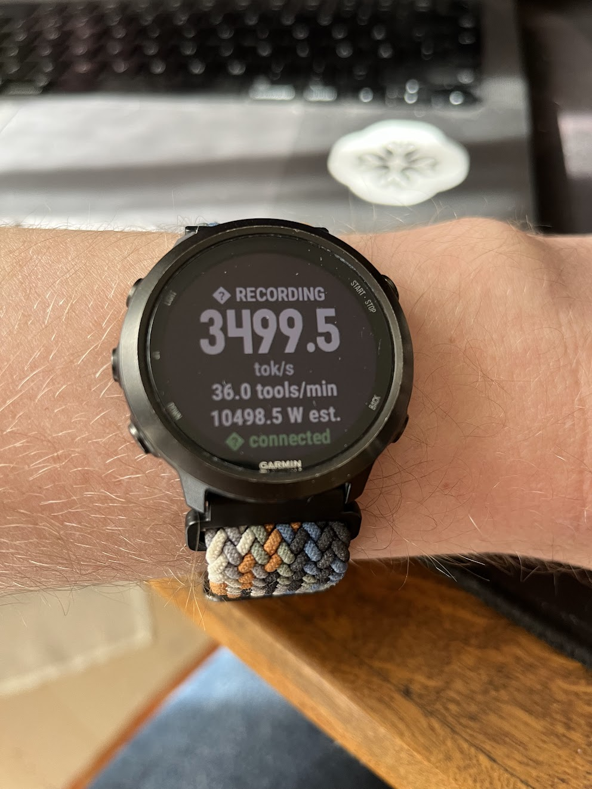

# Claude Code Tracker for Garmin

Records your Claude Code sessions as real Garmin activities. While you code,
your watch captures a `SPORT_GENERIC` activity with your wrist heart rate
alongside custom graphs: tokens/sec, tools/min, estimated server-side watts,
and cumulative tokens. The activity syncs to Garmin Connect like any workout.



---

## ⚠️ Before you install anything

**You found this on the internet.** Before running any of this:

- Read [`IMPLEMENTATION_PLAN.md`](IMPLEMENTATION_PLAN.md) — it describes the full architecture, what runs on your machine, and what leaves it.
- The daemon runs locally and exposes your laptop to the internet via a Cloudflare Tunnel. It only talks to your own watch, authenticated by a bearer key you generate. Nothing goes to Anthropic or any third party.
- The watch app is sideloaded — it is never submitted to the Connect IQ Store.
- No Anthropic credentials are involved anywhere. The daemon reads Claude Code's local session files, it does not proxy the API.

If any of that sounds wrong for your situation, don't install it.

---

## What you need

- A Claude Code subscription and the `claude` CLI
- A Garmin watch from the supported list (see [`IMPLEMENTATION_PLAN.md §4.1`](IMPLEMENTATION_PLAN.md))
- macOS or Linux (Windows requires WSL2)
- A free [Cloudflare account](https://cloudflare.com) if you want a stable tunnel URL (optional — there's a no-account quick-tunnel path too)

---

## Install

There are no manual install instructions. The install is driven by a Claude
Code skill in this repo.

1. Clone the repo and open it in Claude Code
2. Say: **"install the claude code activity tracker"**

Claude will walk you through prerequisites, daemon setup, tunnel choice,
building the watch app for your specific device, and sideloading it.

---

## How it works

```
Claude Code session (your laptop)
    │  reads local JSONL session files
    ▼
Daemon (Node, port 7842, localhost only)
    │  exposed via Cloudflare Tunnel
    ▼
Your Garmin watch  ──────────────────────────────────────▶  Garmin Connect
    polls every 2s, writes FIT fields                        activity + graphs
```

The daemon tails Claude Code's local session JSONL files — no API calls, no
Anthropic credentials. A Cloudflare Tunnel (quick ephemeral or named stable)
bridges the laptop and watch. Bearer key authentication, 404-on-bad-auth,
localhost-only binding.

---

## Health data

`SPORT_GENERIC` / `SUB_SPORT_GENERIC` with real wrist HR. This activity type
does not affect VO2 max, training load meaningfully, or Strava run/ride totals.
Garmin Connect's per-activity "Don't include in stats" toggle is the escape
hatch if you want zero influence on health rollups.

Full analysis in [`IMPLEMENTATION_PLAN.md §8`](IMPLEMENTATION_PLAN.md).

---

## License

MIT
